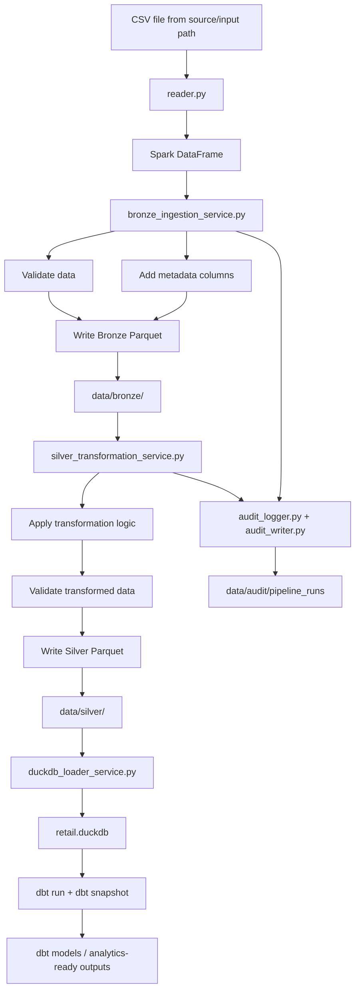

# Retail Data Platform Data Flow

```mermaid
flowchart TD
    A[CSV file from source/input path] --> B[reader.py]
    B --> C[Spark DataFrame]
    C --> D[bronze_ingestion_service.py]
    D --> E[Validate data]
    D --> F[Add metadata columns]
    E --> G[Write Bronze Parquet]
    F --> G
    G --> H[data/bronze/<dataset>]
    H --> I[silver_transformation_service.py]
    I --> J[Apply transformation logic]
    J --> K[Validate transformed data]
    K --> L[Write Silver Parquet]
    L --> M[data/silver/<dataset>]
    M --> N[duckdb_loader_service.py]
    N --> O[retail.duckdb]
    O --> P[dbt run + dbt snapshot]
    P --> Q[dbt models / analytics-ready outputs]

    D --> R[audit_logger.py + audit_writer.py]
    I --> R
    R --> S[data/audit/pipeline_runs]
```
